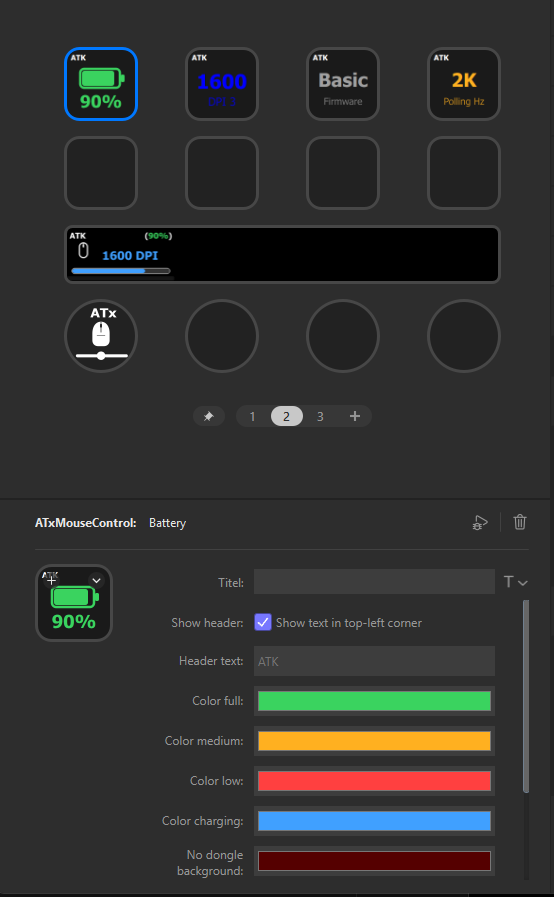

# MyATxMouseControl

A Stream Deck plugin to control **ATK X1 Ultimate** wireless gaming mice (8K dongle) directly from your Elgato Stream Deck — battery level, DPI stages, polling rate and sensor firmware mode. **No ATK HUB required.**

The HID protocol was fully reverse-engineered for this project (EEPROM map, checksums, sensor-mode command) — see [Protocol](#protocol) below.



## Features

| Action | What it does |
|---|---|
| **Battery** | Shows the battery level with configurable threshold colors (full / medium / low / charging). Press to refresh immediately. |
| **DPI Switch** | Cycles through the DPI stages and shows the current DPI value. Stage colors can be read live from the mouse (matching the DPI LED) or customized. |
| **Sensor Firmware** | Switches between *Basic Mode*, *ATK Shard Competitive Firmware* and *ATK Shard Competitive Firmware MAX*. |
| **Polling Rate** | Cycles through a configurable list of polling rates (125 Hz - 8 kHz). |
| **Mouse Dial** (Stream Deck +) | Push: switch mode (DPI / Polling / Firmware). Rotate: change the value. Shows battery top-right and a value bar at the bottom. Touch: refresh. |

All actions share a single central state poller (one HID session for everything), so every display updates simultaneously. Pressing any button triggers an immediate refresh of all actions, including the dial.

### Display states

- **`?`** - no value has been read yet
- **Grayed value + `Zzz`** - the mouse is asleep; the last known value is shown
- **`NO DONGLE`** - the USB receiver is unplugged (detected within ~5 seconds, configurable background color)

Every key can show a configurable header text (default `ATK`) in the top-left corner - or none at all.

## Installation

### From release

Download the latest `com.holgermilz.myatxmousecontrol.streamDeckPlugin` from the [Releases](../../releases) page and double-click it. Stream Deck 6.5+ on Windows 10/11 required.

### From source

```
npm install
npm install -g @elgato/cli
streamdeck link com.holgermilz.myatxmousecontrol.sdPlugin
npm run build
streamdeck restart com.holgermilz.myatxmousecontrol
```

During development: `npm run watch` rebuilds on change and restarts the plugin.

## Compatibility

Built and tested with the **ATK X1 Ultimate** paired to the ATK **8K wireless dongle** (`VID 0x373B`, `PID 0x11D9`). Other ATK / VXE / VGN mice share large parts of this protocol (same command layout and checksum scheme), so adapting the VID/PID in `src/atk-x1.ts` may be all that is needed - feedback welcome.

> **Note:** Close ATK HUB / ATK GEAR while using this plugin. Both talk to the same HID interface and will race each other.

## Protocol

Everything runs over a 17-byte HID report on the configuration interface (`usagePage 0xFF02`, `usage 0x0002`):

```
Byte 0     Report ID (0x08)
Byte 1     Command    0x04 = battery, 0x07 = SetEEPROM, 0x08 = GetEEPROM
Byte 2     Status     (0 when sending)
Byte 3-4   EEPROM address (big endian)
Byte 5     Data length
Byte 6-15  Data
Byte 16    Checksum = (0x55 - sum(bytes 0..15)) & 0xFF
```

EEPROM map (verified by diffing snapshots against ATK HUB changes and by USB captures):

| Address | Content |
|---|---|
| `0x00` | Polling rate: `1K=1, 500=2, 250=4, 125=8` (divider) / `2K=0x10, 4K=0x20, 8K=0x40` (flags). Stored as `[value, 0x55-value]`. |
| `0x02` | Number of DPI stages |
| `0x04` | Active DPI stage (0-based), `[value, 0x55-value]` |
| `0x0C` + n*4 | DPI values per stage: `[dpiX, dpiY, mult, crc]`, where `DPI = (dpiX + 1) * 10 * ((mult & 0x0F) + 1)` and `crc = 0x55 - sum(values)` |
| `0x2C` + n*4 | DPI stage colors: `[R, G, B, crc]` |
| `0xB5` | Sensor firmware mode, 6 bytes: `[01 54] [12 43] [mode, 0x55-mode]` with `0=Basic, 1=Shard, 2=MAX` (captured byte-identically from ATK HUB via USBPcap) |

Battery command `0x04` returns the level in byte 6 and a wired/charging flag in byte 7 - answered by the dongle only while the mouse is awake.

## Settings overview

- Per-action colors and background, plus a separate **No dongle background**
- **Header** text per key/dial (on/off + custom text)
- **DPI Switch:** use the mouse's own stage colors or custom ones
- **Polling Rate:** the list of rates to cycle through (e.g. `1000,4000,8000`)

## Troubleshooting

- **`Zzz` everywhere** - the mouse is asleep. Move it; displays recover automatically within ~5-10 s.
- **`NO DONGLE`** - receiver not found. Check the USB connection.
- **Values don't change** - make sure ATK HUB is closed.
- Logs: `%appdata%\Elgato\StreamDeck\Plugins\com.holgermilz.myatxmousecontrol.sdPlugin\logs`

## Credits

Protocol research was cross-checked against these excellent projects:
[cyberphantom52/libatk-rs](https://github.com/cyberphantom52/libatk-rs) -
[Fan4Metal/ATK_tray](https://github.com/Fan4Metal/ATK_tray) -
[ReformedDoge/0x44oge-ATK](https://github.com/ReformedDoge/0x44oge-ATK)

## Disclaimer

This project is not affiliated with ATK. Settings written by this plugin persist in the mouse's EEPROM exactly as if changed through ATK HUB - use at your own risk.

## License

[MIT](LICENSE) (c) 2026 Holger Milz
